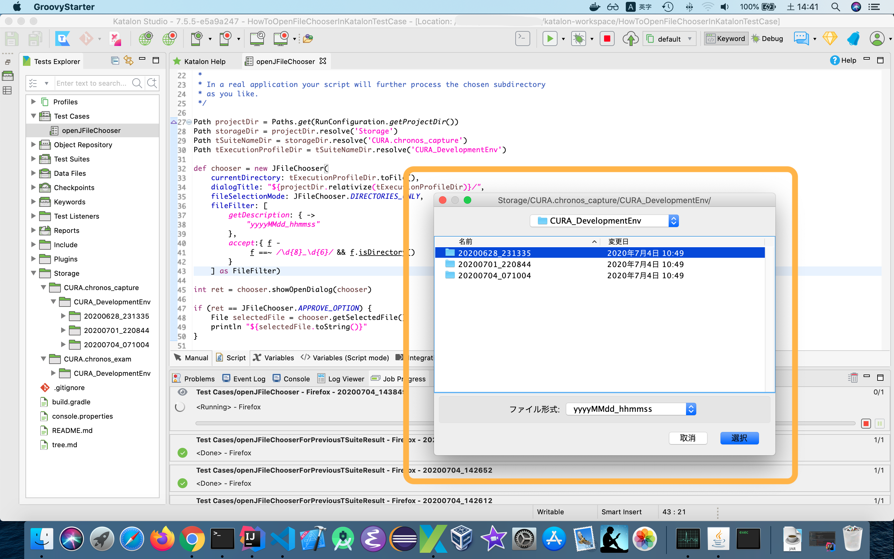

How to open FileChooser in Katalon Test Case
==========

# Background

I have a Katalon Studio project [VisualTestingInKatalonStudio](https://github.com/kazurayam/VisualTestingInKatalonStudio). It is a visual testing tool for Web application. The tool takes screenshots of web pages, save them into .png files. I will execute the tool twice --- before I change my Web Application Under Test, and after I changed it. The tool compares 2 sets of screenshots --- the current screenshot against the previous one. It produces a concise report if it has detected any differences in the page views. I often use this tool when I upgrade/reconfigure my business Web application in production. One of my Katalon project based on the VisualTestingInKatalonStudio processes 300 URLs in 80 minutes  without any human intervention. When I see the report telling me "No Significant difference found in the 300 pages of your AUT", I am relieved. I get confidence that I haven't made any silly mistakes to the production service. This tool frees me from slavery labor of looking at 300 URLs manually before/after system changes.

# Problem to solve

When I execute a image comparison processing, I need to specify which set of previous screenshots to choose as the basis with which the current screenshots are compared against. The following image shows an example how the previous sets of screenshots are stored and accumulated in a VisualTesting project directory.

```
VisualTesting project
├── Storage
│   ├── CURA.chronos_capture
│   │   └── CURA_DevelopmentEnv
│   │       ├── 20200628_231335
│   │       ├── 20200701_220844
│   │       └── 20200704_071004
│   │           ├── CURA.visitSite
│   │           │   ├── appointment.php%23summary.png
│   │           │   ├── default%23appointment.png
│   │           │   ├── home.png
│   │           │   ├── profile.php%23login.png
│   │           │   ├── revisited.png
│   │           │   └── トップ.png
│   │           └── material-metadata-bundle.json
```

The current version (1.19.5) of "VisualTestingInKatalonStudio" has a test case script [CURA/restorePreviousScreenshots](https://github.com/kazurayam/VisualTestingInKatalonStudio/blob/master/Scripts/CURA/restorePreviousScreenshots/Script1560821220922.groovy). This selects one of the timestamp directories(yyyyMMdd_hhmmss). The default behavior is to choose the last previous set.

```
WebUI.callTestCase(findTestCase("Test Cases/VT/restorePreviousTSuiteResult"), 
                    ["STRATEGY":"last"])
```

Potentially the script can chose any other set if I specify the exact timestamp (e.g, `20200628_231335`) as:

```
//WebUI.callTestCase(findTestCase("Test Cases/VT/restorePreviousTSuiteResult"), 
                    ["STRATEGY":"exactlyAtOrBefore", "timestamp":"20200628_231335" ])
```

However I do not want to edit `CURA/restorePreviousScreenshots` script often. I would rather like to interactively visit the directories and select one from the GUI-rendered list.

So my question is: **Is it possible to open File Chooser dialog in a Katalon Test Case?** 

# Solution

In a test case script in Katalon Studio, I can use [`javax.swing.JFileChooser`](https://docs.oracle.com/javase/8/docs/api/javax/swing/JFileChooser.html) to open a File Chooser.

# Description

Just have a look at the sample test case script [`Test Cases/openJFileChooser`](Scripts/openJFileChooser/Script1593840740754.groovy).




